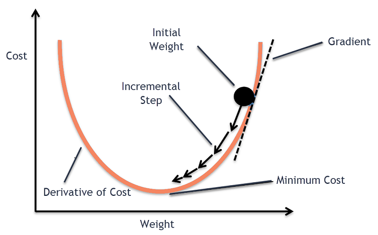

# Gradiente Descendente

> **Tópicos Avançados em Redes Sem Fio — 06 de junho de 2024**
> 

---

O gradiente descendente, ou método da descida de gradiente, é um algoritmo numérico de otimização que pode ser utilizado para encontrar mínimos de uma função.

A ideia do método é ajustar iterativamente os parâmetros de uma função, onde em cada passo toma-se a direção negativa do gradiente, a fim de encontrar um mínimo local.

Esse algoritmo é aplicado no campo de aprendizado de máquina, pois é essencial para o treinamento de modelos de redes neurais, uma vez que redes neurais visam minimizar uma função de custo.

## Gradiente

Considere uma função $f(x,y)$ dada por:

$$
f(x, y) = (x - 2)^2 + (y + 3)^2
$$

Matematicamente, o gradiente da função é o vetor formado por suas derivadas parciais:

$$
∇f(x_1, x_2, \mathellipsis, x_n) = \bigg (\dfrac{∂f}{∂x_1},\ \dfrac{∂f}{∂x_2}, \mathellipsis, \dfrac{∂f}{∂x_n} \bigg )
$$

$$
∇f(x,y) = \bigg (\dfrac{∂f}{∂x},\ \dfrac{∂f}{∂y} \bigg ) = (2(x−2),\ 2(y+3))
$$

$$
∇f(x,y) = (2x−4,\ 2y+6)
$$

O gradiente aponta na direção de maior crescimento da função. Em outras palavras, ele indica como modificar os parâmetros de entrada para obter o maior aumento no valor da função.

Dessa forma, na descida de gradiente, uma vez que o objetivo é minimizar a função, basta utilizar essa informação do gradiente para mover-se na direção oposta.

### Exemplo com duas dimensões

### Exemplo com três dimensões

## Como o algoritmo funciona?

Dada uma função $f(x,y)$

1. **Inicialização**: Define-se um ponto inicial $(x_0, y_0)$ e uma taxa de aprendizado $\alpha$, que controla o tamanho dos passos
2. **Cálculo do Gradiente**: Calcula-se o gradiente da função no ponto atual
    
    $$
    \nabla f(x,y) = \bigg (\dfrac{∂f}{∂x},\ \dfrac{∂f}{∂y} \bigg )
    $$
    
    $$
    grad\_x \leftarrow \dfrac{∂f}{∂x}
    \\
    grad\_y \leftarrow \dfrac{∂f}{∂y}
    $$
    
3. **Atualização dos Parâmetros**: Ajusta-se os valores dos parâmetros, movendo-os na direção oposta ao gradiente
    
    $$
    x_{i + 1} = x_i - \alpha \cdot \dfrac{∂f}{∂x_i}
    \\
    y_{i + 1} = y_i - \alpha \cdot \dfrac{∂f}{∂y_i}
    $$
    
    $$
    x \leftarrow x - \alpha \cdot grad\_x
    \\
    y \leftarrow y - \alpha \cdot grad\_y
    $$
    
4. **Repetição**: Repete-se os passos $2$ e $3$ até a função convergir para um mínimo ou atingir o número máximo de iterações

## Treinamento de redes neurais

O processo de treinamento de redes neurais envolve ajustar os pesos das conexões entre neurônios para minimizar a diferença entre as previsões da rede e os valores reais dos dados de treinamento.

Esse ajuste é feito através de um algoritmo conhecido como retropropagação, ou backpropagation, que utiliza o conceito de gradiente descendente.

### Passos do algoritmo

Existem três etapas principais:

1. **Forward Pass (Propagação)**:
    
    Os dados de entrada são propagados através da rede, camada por camada, até chegar à camada de saída. Então, a rede gera uma previsão com base nos pesos atuais
    
    Cada neurônio na rede aplica uma função de ativação aos seus inputs ponderados para produzir uma saída
    
2. **Cálculo do Erro**:
    
    Após a propagação, a previsão da rede é comparada com o valor real do dado de treinamento usando uma função de custo / função de perda
    
    A função de custo quantifica a diferença entre a previsão e o valor real, e a rede tentará minimizar esse valor durante o treinamento
    
3. **Backward Pass (Retropropagação)**:
    
    A retropropagação começa calculando o gradiente da função de custo em relação à saída da rede. Isso é feito aplicando a regra da cadeia para derivadas parciais, de trás para frente, a partir da camada de saída até a camada de entrada
    
    O gradiente é calculado para cada peso na rede, que indica a direção e a magnitude das mudanças necessárias para reduzir o erro
    
    Os pesos são então ajustados na direção oposta ao gradiente. Esse ajuste é geralmente multiplicado por uma taxa de aprendizado, que controla o tamanho dos passos dados na direção do gradiente