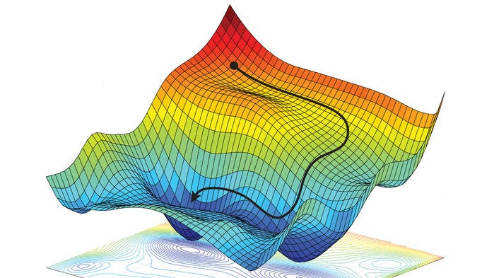
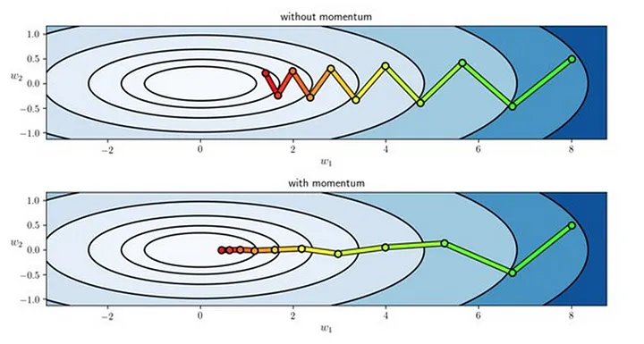

# Gradiente com Momentum

> **Tópicos Avançados em Redes Sem Fio — 13 de junho de 2024**
> 

---

## Gradiente Descendente Convencional

$$
\large
w_{t+1} = w_{t} - \alpha \cdot \nabla f(w_{t})
$$

$w_t$ — Vetor de parâmetros na iteração $t$

$\alpha$ — Taxa de aprendizado

$f$ — Função de perda

$\nabla f$ — Gradiente de $f$

No gradiente descendente convencional, o objetivo é minimizar uma função de perda movendo-se na direção oposta ao gradiente da função em relação aos parâmetros, uma vez que gradiente aponta na direção de maior crescimento da função.

Isso é feito iterativamente, atualizando os parâmetros até atingir uma condição de parada, que em geral é a minimização da função de perda.

### Problema das Oscilações

Em muitas aplicações de aprendizado de máquina, a função de perda não é uma superfície suave e convexa. Em vez disso, ela pode ter várias bacias, vales estreitos e picos

Exemplo de uma superfície da função de perda

Essas superfícies são comuns em funções de perda com muitas dimensões, como aquelas encontradas no treinamento de redes neurais.

---

**Possível solução:**

Uma ideia seria investir no ajuste da taxa de aprendizado. Contudo, isso pode ser uma tarefa delicada. Uma taxa de aprendizado muito baixa pode levar a uma convergência extremamente lenta, pois os passos são pequenos demais para fazer progresso significativo.

Por outro lado, uma taxa de aprendizado muito alta pode levar a grandes passos que causam saltos de um lado para o outro do vale. Isso é particularmente ruim em vales estreitos, porque nesse caso os gradientes em direções perpendiculares ao vale podem ser grandes.

Exemplo de convergência com diferentes taxas de aprendizado

---

Diante desse contexto, é interessante buscarmos uma outra abordagem. Nesse sentido, temos explorado o conceito de “momentum”, que trouxe contribuições significativas para mitigar o problema das oscilações.

## Gradiente Descendente com Momentum

O gradiente com momentum é uma técnica utilizada para acelerar a convergência do algoritmo de descida de gradiente, especialmente em problemas onde a superfície de erro apresenta as características que foram mencionadas anteriormente.

### Como Funciona

Esse método introduz um termo de “momentum” (velocidade) que é calculado a partir do gradiente passado e o atual, atribuindo um peso a cada um. Então, a atualização dos parâmetros é feita usando essa velocidade em vez do gradiente puro.

Isso ajuda a suavizar as atualizações, reduzindo a oscilação e acelerando a convergência.

$$
\large
v_{t+1} = \beta \cdot v_{t} + (1 - \beta) \cdot \nabla f(w_{t})
$$

$$
\large
w_{t+1} = w_t - \alpha \cdot v_{t+1}
$$

O termo $v_t$ é a velocidade, que representa uma acumulação ponderada dos gradientes anteriores.

O termo $\beta$ é o coeficiente ou fator de momentum, que é um valor entre $0$  e $1$ que determina quanta influência o gradiente das iterações anteriores deve ter na atualização atual dos parâmetros.

Os valores mais comuns de utilizados na prática são: $0.9$, $0.99$, $0.8$
